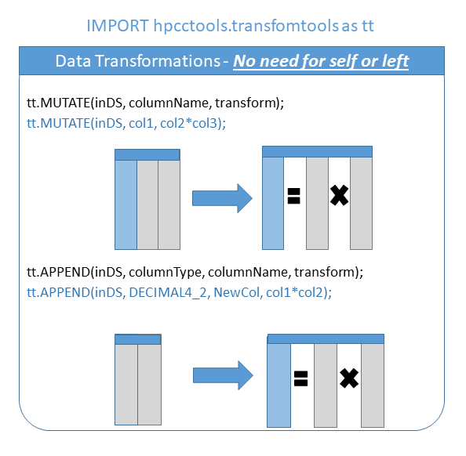
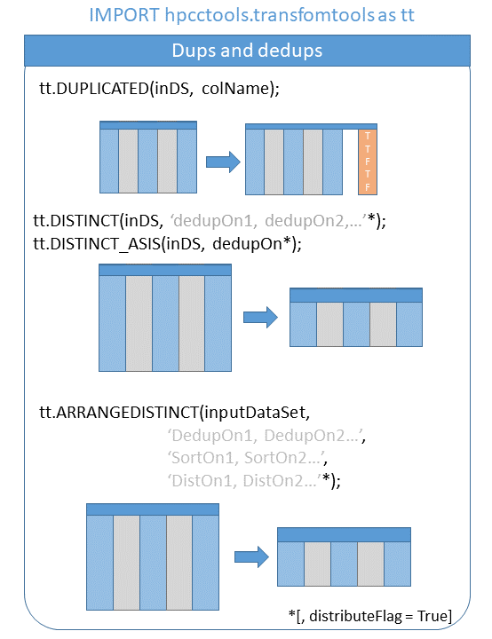
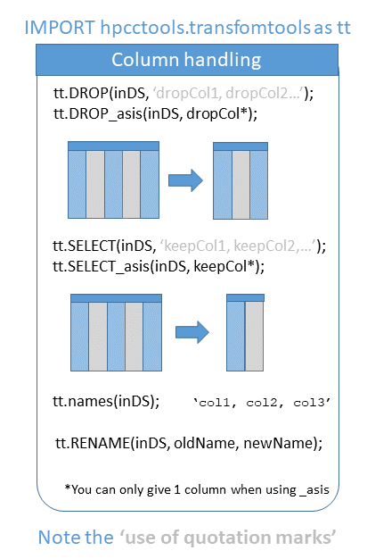
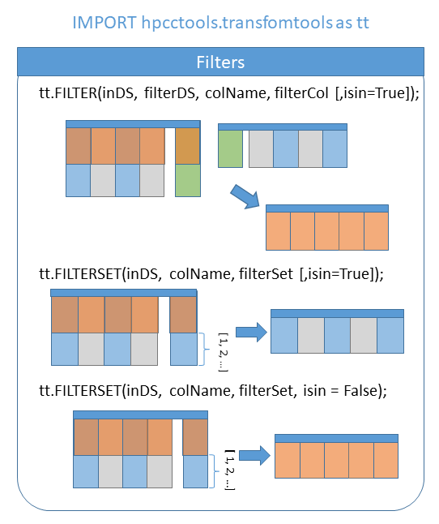
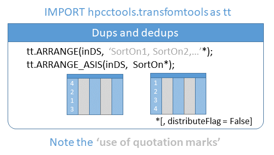
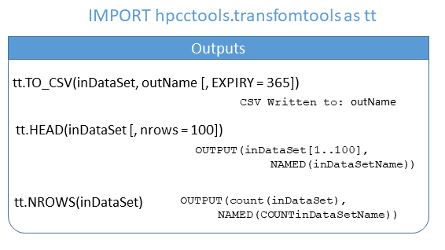
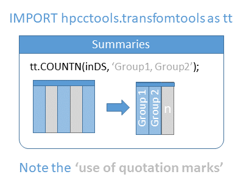
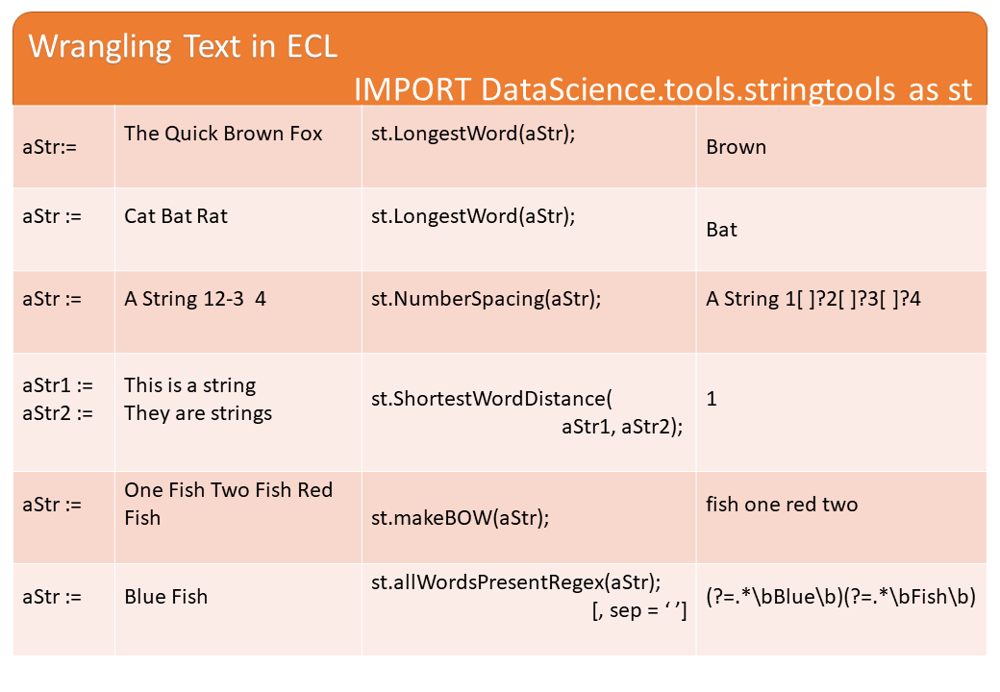
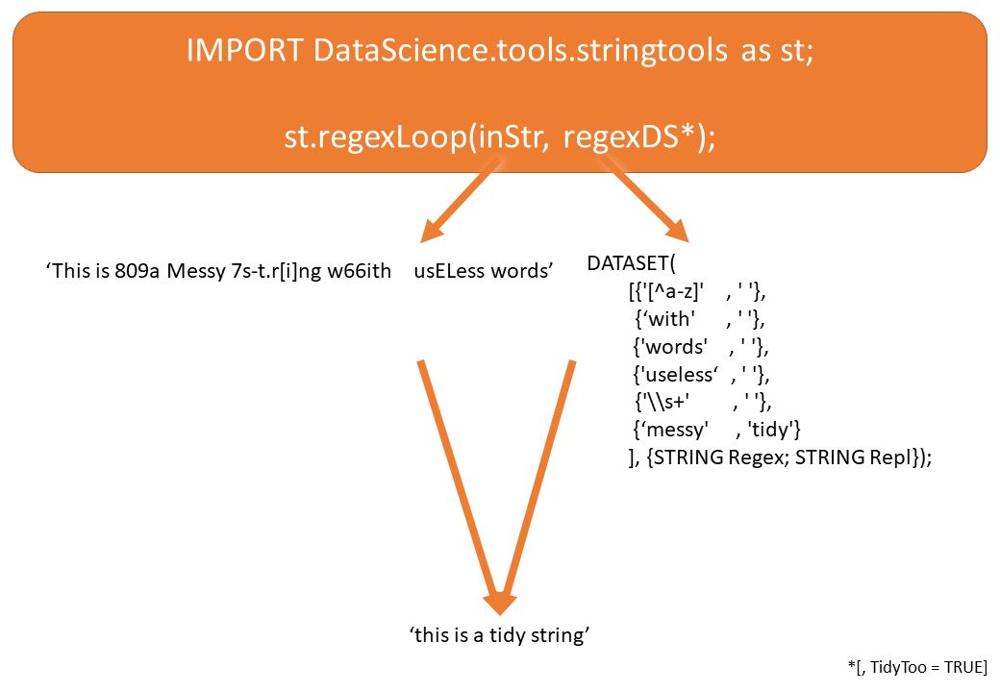

# dapper
Functions and macros that make HPCC easier and faster to code in. Currently broken down into transform tools for data transformation and string tools for standard string tidying. 

- [Documentation](#documentation)
- [Installation](#installation)
- [Transform Tools](#transform-tools)
  * [Data Transformations](#data-transformations)
  * [Duplicates](#duplicates)
  * [Column Transforms](#column-transforms)
  * [Filters](#filters)
  * [Arrangement](#arrangement)
  * [Outputs](#outputs)
  * [Summaries](#summaries)
- [String Tools](#string-tools)
  * [Regex Loop](#regex-loop)
- [Issues, Bugs, Comments? ](issues-bugs-comments)
    
## Documentation
The package's github is available at: https://github.com/OdinProAgrica/dapper

This package is released under GNU GPLv3 Licence: https://www.gnu.org/licenses/gpl-3.0.en.html

## Installation
Copy the dapper folder into an ECL repository (or add the folder to your IDE's environment), you can then import the relevent modules.

**Do note that the standard nomenclature for importing the modules should be respected.** This is because each module references its own functions, requiring a known import name. Modules should always be imported as:

* TransformTools: tt
* StringTools: st

For example: 
IMPORT dapper.TransformTools as tt;

## Transform Tools

### Data Transformations

### Duplicates

### Column Transforms

### Filters

### Arrangement

### Outputs

### Summaries

## String Tools

### Regex Loop

## Issues Bugs Comments? 
Please use the package's github: https://github.com/OdinProAgrica/dapper

Any contributions are also welcome.